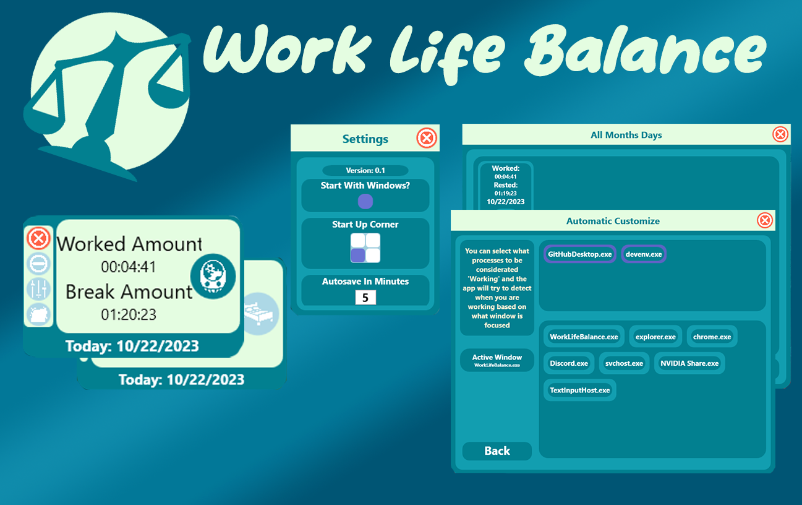

# WorkLifeBalance

WorkLifeBalance is a productivity application designed to help users monitor and optimize their time usage. The app provides automatic toggling between work and rest modes, detailed activity tracking, and a comparison of productivity metrics over time.

## Features

### Time Tracking
- **Automatic Toggles**:
  - Automatically detects the active window to determine if the user is working or resting.
  - Customize which applications are classified as "work" to ensure accurate tracking.

### Productivity Analysis
- **Monthly Comparison**:
  - Compare current month's productivity metrics with last month's performance.
  - View detailed daily activity logs to understand time usage.
- **Pomodoro Integration**:
  - Use the Pomodoro technique with a built-in "force work" option to eliminate distractions.
- **Afk Detection**
  -  Use mouse tracking to detect away from keyboard scenarios and switch to IDLE state
- **Customizable**
  -  Modify action intervals, save&load, state detection, window detect, afk detection and more

### Modular Architecture
- Enable or disable features at runtime to suit your workflow and preferences.

### System Requirements
- Requires Administrator privileges to monitor and track applications running with elevated permissions.

## Installation and Setup

1. Download the application from the official website and follow the instructions.
   https://roberbot.itch.io/work-life-balance

3. Launch the application with Administrator privileges to enable full functionality.

## Usage

1. Customize your settings:
   - Define which applications are considered "work."
   - Configure the Pomodoro timer for forced focus sessions when used.
2. Let the app track your activity automatically:
   - Monitor your productivity without manual toggles.
3. Analyze your productivity:
   - Compare monthly metrics and review daily activity to identify patterns.

Detailed video tutorial:
https://www.youtube.com/watch?v=PVNq04e8AJo

## Support
If you like the app and want to support it:
https://buymeacoffee.com/roberbot

## Future Planned Features
- The ability to create custom states like "Learing" "Gaming" on top of the default "Resting, Idle, Working" states.
- An **Advanced Detection** mode that's able to more accurate detect activities even specific webpages.
- A possible port from WPF to Avalonia to allow for Linux support.
- Enhanced documentation for a smoother community contribution process.

## License
This project is licensed under the MIT License. See the LICENSE file for details.
